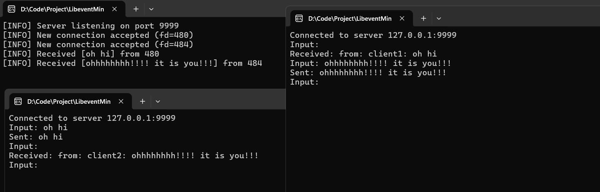

# LibeventMiniChat
**本项目是一个学习libevent使用方法的学习项目, 服务器将客户端发来的消息广播到其他客户端**

Server端采用Libevent的库函数, 
Client端采用socket编程

双端用一个固定4字节长度(uint32_t)的首部来存储消息长度
<font color="#ff0000">接收端维护缓冲区, 累计数据直到收到完整信息</font>
<font color="#ff0000">发送方无需关心分包, 接收端会自己处理</font>
# 运行截图



下面是一些笔记
## LibeventServer
eventBase管理所有event
**`evconnlistener_new_bind`**
简化了socket的创建, 绑定, 监听和事件注册流程
```c
evconnlistener_new_bind(
    event_base* base,            // 事件循环基础
    evconnlistener_cb callback,   // 新连接回调函数（AcceptConn）
    void* arg,                   // 传递给回调函数的参数（this指针）
    int flags,                   // 选项（如端口复用）
    int backlog,                 // 最大等待连接队列长度
    const sockaddr* sa,          // 绑定地址
    int socklen
);
```

<font color="#ff0000">为新来的客户端socket创建buffevent, 并且绑定一个session</font>
bufferevent**自动管理数据的接收和发送，无需手动 `read()` / `write()`, 而且能够直接绑直接绑定读/写/错误事件的处理函数,自动适配不同系统的 I/O 模型（如 epoll、kqueue）**

客户端发送数据, buffevent发现可读, 触发buffevent回调, buffevent回调调用session
	在读取数据的时候用一个buffer来读取, 用evbuffer_remove来读取数据
	传入buffer. data () 和长度, 即可像数组传入首地址一样读取
客户端断开时也是一样
服务器断开时通过NetworkManager释放所有资源

在处理session的时候加锁(创建, 删除, 获取), 保证多线程安全 (防御式编程)
## Logger
template<typename... Args>接收任何类型和数量的参数
双&&可以接收任意类型的参数 ([[../000-计算机大类/c++/左值引用和右值引用|左值引用和右值引用]])
**forward完美转发, 保持参数的原始类型**
static静态方法, 在任何地方都可调用

## TCPClient
使用windows的**WSAStartup**初始化Winsock库
配置socket, 也就是配置sockaddr
调用connect连接服务器

**inet_pton**将ip地址转化为二进制格式

socket设置非阻塞模式, 不等待数据到达或发送完成
要注意发送时转成网络字节序
还有select的使用方式, 在connect中确定连接成功的select与在run中确定是否可读的select
## 其他
创建socket, 返回fd, 操作系统自动生成socket结构体, 内部是一些控制块, 比如协议, 报文结构什么的

[[../000-计算机大类/TCP_IP网络编程/sockaddr|sockaddr]] 将IP端口信息存入内核的socket结构体中

[[../000-计算机大类/Linux高性能服务器编程/select|select]] 遍历访问fd, 检查是否有数据可读, 是用bitmap的
[[../000-计算机大类/Linux高性能服务器编程/poll|poll]] 也是遍历访问, 但是用的是pollfd数组
[[../000-计算机大类/TCP_IP网络编程/优于select的epoll|优于select的epoll]] 用红黑树保存注册的fd, 用链表保存已经就绪的fd 

水平触发LT, 只要状态满足条件就一直触发, 可以**一部分一部分**读
边缘触发ET, 只在状态从不满足变为满足时触发一次, 所以**必须一次读完**

[[fd的等待队列wait queue]]
